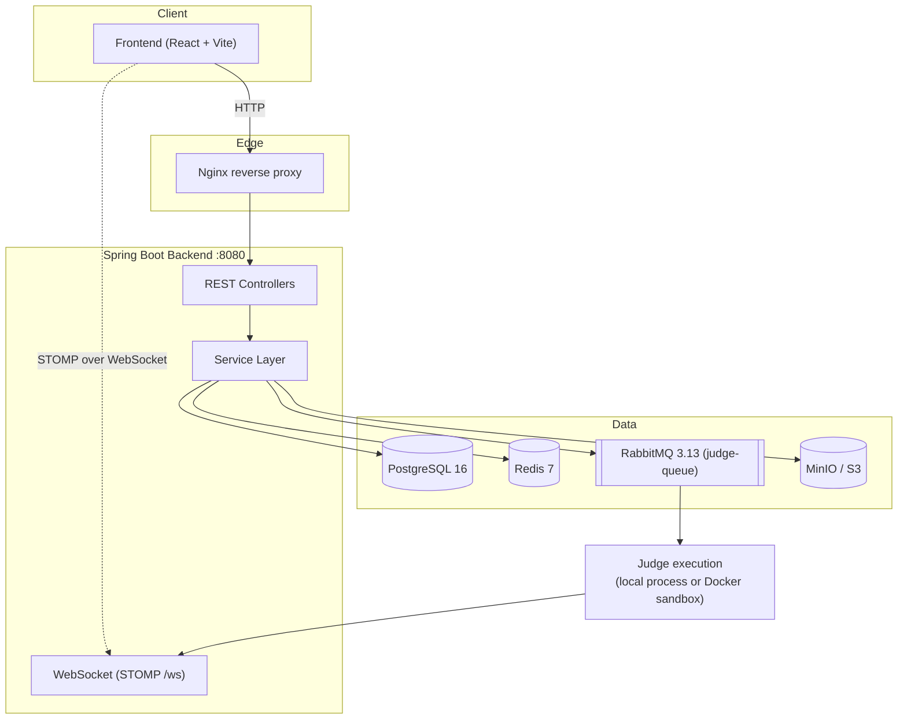
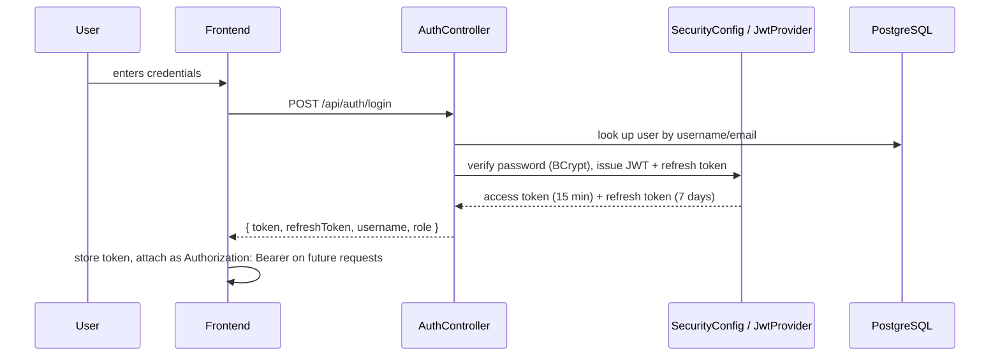
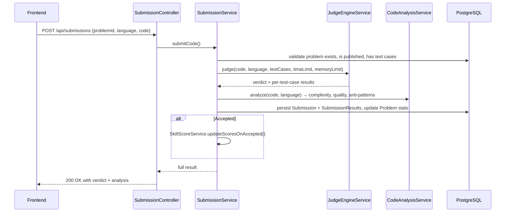
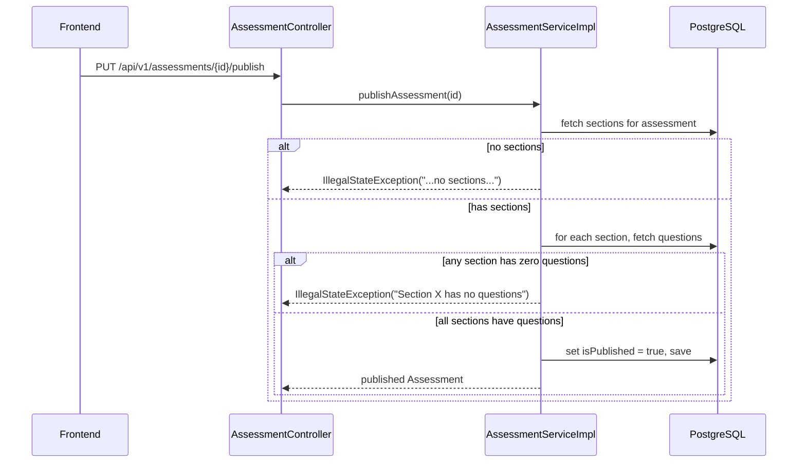
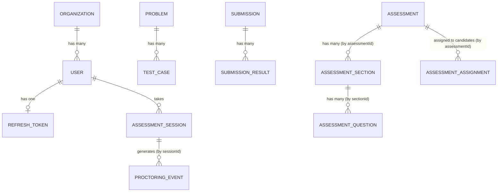

# CodeSphere — Architecture

## System Overview

- **Backend:** Java 21, Spring Boot 3.3.1, stateless JWT auth, Spring Data JPA over PostgreSQL, Flyway migrations.
- **Frontend:** React 19 + Vite, with the active application in `frontend/`.
- **Async work:** RabbitMQ carries judge jobs from the queue-based submission path to a consumer that executes code and pushes results back over WebSocket.
- **Storage:** file uploads go through a `StorageProvider` abstraction with local-disk and MinIO implementations, selected by config.

---

## Backend Module Breakdown

| Package | Responsibility |
|---|---|
| `controller/` | REST endpoints — one controller roughly per resource (Auth, Problem, Submission, Assessment, Section, Question, File, Proctoring, Interview) |
| `service/` | Business logic. Two submission-related services exist in parallel (see below). |
| `model/` | JPA entities for the compiled, working feature set (User, Problem, TestCase, Submission, SubmissionResult, Organization, RefreshToken, AssessmentSession, ProctoringEvent/Config, AuditLog, FileAttachment) |
| `entity/` | A **second** entity package for the newer Assessment/Section/Question/Assignment model — kept separate from `model/` for reasons that predate this doc; worth consolidating into one package eventually |
| `repository/` | Spring Data JPA repositories, one per entity |
| `security/` | JWT provider, filter, auth entry points |
| `config/` | `SecurityConfig`, `RabbitMQConfig`, `WebSocketConfig`, `StorageConfig`, `OpenApiConfig`, CORS |
| `dto/` | Request/response objects, organized by feature |
| `messaging/` | `SubmissionProducer`/`SubmissionConsumer` for the async judge path |
| `seeder/` | `DataSeeder` — populates demo data (Demo Corp org, admin/evaluator/candidate accounts) on the `dev` profile |

### Build-path status

The active controllers, services, DTOs, and models are located under
`backend/src/main/java/com/CodeSphere/backend/...`, which is Maven’s standard
source path. The backend compile check succeeds with this source layout.

---

## Known Issues

These are real, current inconsistencies in the codebase. Documented here so
anyone (including future us) doesn't assume more is finished/consistent than
it actually is.

### 1. Two frontend implementations
- `/frontend` — the one `docker-compose.yml`/`Dockerfile.frontend` actually build. Minimal: auth, dashboard, problems, submissions, interview prep.
- `/src`, `/public` (repo root) — a separate, more complete build with its own `package.json`/`vite.config.ts`, implementing most of the assessment/admin/reporting/proctoring UI from the project plan.

These need to be reconciled — decide which is canonical, port anything
valuable from the other, and delete the loser. Until then, don't build new
frontend features in `/frontend` without checking whether `/src` already has
a version.

### 2. Two parallel code-judging implementations
| | Path A (sync) | Path B (async) |
|---|---|---|
| Entry point | `POST /api/submissions` | `POST /api/v1/problems/{id}/submit` |
| Execution | In-request, `JudgeEngineService` spawns `javac`/`g++`/`python3`/etc. directly | Queued via RabbitMQ (`judge-queue`), executed by `SubmissionConsumer` via `DockerExecutionService` |
| Result delivery | Synchronous HTTP response | Async, pushed over WebSocket to `/queue/submission-result/{id}` |
| Sandboxing | None — runs on the host process | Intended to run inside Docker (`JUDGE_USE_DOCKER` env flag; currently `false` in `docker-compose.yml`, so it also falls back to host execution) |

Both are live and compiled. Pick one for the demo — Path B is architecturally
the "real" design (queue + sandboxed execution + WebSocket push matches the
plan's Week 2 goals) but Path A is simpler to demo live since there's no
polling/subscription needed. Document whichever is chosen in the demo script.

### 3. `SecurityConfig` references endpoints that don't exist yet
`SecurityConfig` has role-based rules for `/api/super-admin/**`,
`/api/org/**`, `/api/exams/manage/**`, `/api/courses/**`, and
`/api/candidate/**` — none of these have a matching controller. Likely
written ahead of the corresponding feature. Harmless (an unmatched rule just
never triggers), but worth knowing these aren't live yet.

Also, `/api/v1/assessments/**` and `/api/proctoring/**` have **no explicit
role restriction** — they fall through to the default `anyRequest().authenticated()`,
meaning any logged-in user (including a `CANDIDATE`) can currently create/publish
assessments or read proctoring data. Worth locking down before demo if that
matters for the scenario being shown.

### 4. Two entity packages (`model/` and `entity/`)
Older/compiled-first features (User, Problem, Submission, etc.) live in
`model/`; newer Assessment-related entities live in `entity/`. Functionally
fine since packages don't collide, but it's an easy source of "where do I put
this new entity?" confusion. Consolidating is a nice-to-have, not urgent.

### 5. Missing account-recovery flow
`ForgotPasswordRequest`/`ResetPasswordRequest` DTOs and the `User` entity's
`resetPasswordToken`/`emailVerificationToken` fields exist, but there's no
controller or service method implementing forgot-password, reset-password, or
email verification anywhere in the compiled backend.

---

## Data Flow: Authentication

## Data Flow: Code Submission (Path A — synchronous)

## Data Flow: Assessment Publish

---

## Entity Relationships (as implemented today)

Note: most relationships beyond the ones shown with real JPA `@ManyToOne`
mappings (`User→Organization`, `RefreshToken→User`, `AssessmentSession→User`,
`TestCase→Problem`, `SubmissionResult→Submission`, `ProctoringEvent→AssessmentSession`)
are implemented as plain foreign-key ID columns (`assessmentId`, `sectionId`,
`problemId`, etc.) rather than full JPA object relationships. That's a
deliberate-looking pattern in the newer `entity/` package — it avoids lazy-loading
pitfalls but means you look up related rows via repository queries rather than
`entity.getRelatedThing()`. Keep this consistent if you add new entities in
that package.

For full column-level detail, see [Database Schema](../database/README.md).

---

## Frontend Structure

The active frontend is `frontend/`: React/Vite pages per route, shared
components, Axios API calls, Monaco for code editing, and auth state in
`AuthContext`. It persists the JWT and current user in browser storage for a
local development session. The repository-root `src/` directory is legacy
material and is not the Vite application used by the current Docker or local
frontend workflow.

---

## Deployment Topology

## Recent design additions

### AI boundary

Gemini calls are made only by the Spring Boot backend. The browser never receives `GEMINI_API_KEY`.
Candidate Coding Help has a tutoring-only prompt; admin AI Insights analyzes completed submission excerpts and is explicitly advisory. Charts use deterministic database metrics rather than AI-generated numbers.

### Security and proctoring boundary

The browser can record observable assessment events—tab visibility changes, window focus loss, and fullscreen exits—but cannot inspect other installed applications or other browser windows. These signals are written to `proctoring_events` and displayed to authorized admins in the Security center. Login/logout and key administrative actions are stored in encrypted-IP audit records.

See [Deployment Guide](../deployment/README.md) for the full Docker Compose
breakdown, ports, and environment variables. In short: Nginx on `:80` fronts
both the backend (`:8080`) and frontend (`:3000`) containers; Postgres,
Redis, RabbitMQ, and MinIO each run as their own container with healthchecks
gating backend startup.
